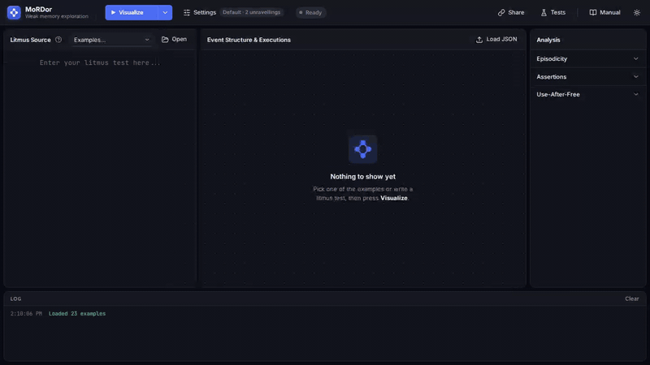

[](https://github.com/christiankissig/mordor/actions/workflows/ci.yml)

[](https://github.com/christiankissig/mordor/actions/workflows/integration.yml)


# MoRDor - Symbolic Modular Relaxed Dependencies (in OCaml)

MoRDor is a tool for exploring weak memory. Given a concurrent C-like program as
a litmus test, it computes the program's justified executions: the ways its
reads and writes can resolve under relaxed memory, each backed by
justifications of what every write depends on. A memory model then decides
which executions are coherent. Because every execution carries the
justifications it was built from, MoRDor shows not only which outcomes a model
allows but why.

MoRDor is a reference implementation of Symbolic Modular Relaxed Dependencies
(SMRD)
["Symbolic MRD: Dynamic Memory, Undefined Behaviour, and Extrinsic Choice" by Jay Richards, Daniel Wright, Simon Cooksey, Mark Batty](https://2025.splashcon.org/details/OOPSLA/104/Symbolic-MRD-Dynamic-Memory-Undefined-Behaviour-and-Extrinsic-Choice).

**Caveat** Do not use until version 1.

<picture>
  <source media="(prefers-color-scheme: light)" srcset="demo/out/mordor-demo-light.gif">
  
</picture>

The web UI above finds a use-after-free reachable when the flag is written with
a relaxed store, then confirms it is gone once the store is made releasing.

The same analysis from the command line:


See [demo/README.md](demo/README.md) for how the recordings are produced
(`make demo` and `make demo-cli`). Every command in the CLI clip is really run —
the output on screen is captured from `mordor` itself.

## Overview

MoRDor explores weak memory through justified executions. It interprets a
program symbolically as an event structure, derives justifications for its
writes, freezes them into executions with their dependencies, and checks those
executions against memory models such as sMRD and RC11.

The command-line interface and web UI provide:
- Parsing and validating programs and litmus tests
- Computing and visualising event structures, justifications and executions
- Checking `allow` and `forbid` assertions under a memory model, and comparing
  models execution by execution
- Deciding episodicity of unbounded loops
- Finding use-after-free

The web UI's manual, at `/manual/` on a running server
([web/frontend/manual.html](web/frontend/manual.html)), explains the concepts,
the UI and the litmus test language.

## Project Structure

```
mordor/
├── dune-project
├── README.md
├── Dockerfile
├── docker-compose.yml
├── Makefile
├── src/          # Core library (mordor_lib) — see src/README.md
├── cli/          # CLI entry point (mordor) — see cli/README.md
├── web/          # Web server (mordor-web) — see web/README.md
├── test/         # Unit and integration tests
├── litmus-tests/ # Litmus test suite
└── programs/     # Sample concurrent programs
```

- `src/`: Core analysis library shared by CLI and web server. See [src/README.md](src/README.md).
- `cli/`: `mordor` executable — argument parsing, pipeline orchestration. See [cli/README.md](cli/README.md).
- `web/`: `mordor-web` Dream server — SSE streaming, REST API, browser UI. See [web/README.md](web/README.md).
- `test/`: Alcotest unit tests (`dune test`) and integration tests (`dune exec test/test_integration.exe`).
- `litmus-tests/`: Litmus test suite run by CI.
- `programs/`: Hand-written sample programs including episodicity examples.

## Building the MoRDor Web UI

It is recommended to build and run MoRDor in Docker using the Makefiles. See the
[Docker Guide](DOCKER_GUIDE.md) for details.

```bash
make build # build the Docker container image
make run   # run the Docker container
make stop  # stop the Docker container
make clean # clean up
```

## Building the Executables

Build with Dune

```bash
dune build
```

Build and view documentation with

```bash
opam install odoc
dune build @doc
xdg-open _build/default/_doc/_html/index.html 
```

## Profiling

```bash
OCAML_LANDMARKS=on dune exec mordor
```

## Running

Run the CLI with

```bash
dune exec mordor
```

with stacktraces

```bash
OCAMLRUNPARAM=b dune exec mordor
```

It is recommended to run the Web interface in Docker as described in the
[Docker Guide](DOCKER_GUIDE.md).

```bash
make run
```

Run the Web UI locally with

```bash
dune exec mordor-web
```

## Testing

Run unit tests with

```bash
dune test
```

Run integration tests (core pipelines and litmus test suite) with

```bash
dune exec test/test_integration.exe
```

## Command Line Interface

MoRDor supports several commands for analyzing litmus tests and generating outputs.

### Commands

- **`run`**: Full verification pipeline — parse → interpret → dependencies → assertions
- **`parse`**: Parse a litmus test to IR only
- **`interpret`**: Parse and interpret to generate the event structure
- **`episodicity`**: Check loop episodicity (requires `--single`)
- **`visual-es`**: Visualize event structures (requires `--single`)
- **`futures`**: Compute future states (requires `--single`)
- **`executions`**: Export all executions with events and `po`/`dp`/`ppo`/`rf`/`rmw` relations as JSON (requires `--single`)
- **`dependencies`**: Compute dependency relations (not yet implemented)

### Options

#### Input Selection
- `--samples`: Use built-in sample programs (default)
- `--all-litmus-tests <dir>`: Process all `.lit` files in specified directory
- `-r`: Scan directories recursively (use with `--all-litmus-tests`)
- `--single <file>`: Process a single `.lit` file

#### Output Configuration
- `--output-mode <mode>`: Set output format
  - `json`: JSON format (visual-es, futures)
  - `dot`: Graphviz DOT format (visual-es)
  - `html`: HTML format (visual-es)
  - `isa`: Isabelle theory output (parse, futures)
- `--output-file <file>`: Output file path (default: stdout)

#### Loop Semantics
- `--step-counter <n>`: Global loop unrolling bound (default: 2)
- `--step-counter-per-loop <n>`: Per-loop unrolling bound
- `--symbolic-loop-semantics`: Symbolic loop representation (required for `episodicity`)

#### Execution
- `--threads <n>`: Number of parallel threads (default: 1)

#### Logging
- `--debug` / `--info` / `--warning` / `--error`: Log verbosity level

### Usage Examples

#### Parsing Litmus Tests

```bash
# Parse a single litmus test
dune exec mordor -- parse --single test.lit

# Parse with Isabelle output
dune exec mordor -- parse --single test.lit --output-mode isa

# Parse all tests in a directory
dune exec mordor -- parse --all-litmus-tests ./litmus-tests

# Parse recursively
dune exec mordor -- parse --all-litmus-tests ./litmus-tests -r
```

#### Running Verification

```bash
# Run verification on built-in samples
dune exec mordor -- run --samples

# Run verification on a single file
dune exec mordor -- run --single test.lit

# Run verification on all tests in directory
dune exec mordor -- run --all-litmus-tests ./litmus-tests

# Run verification recursively with parallel threads
dune exec mordor -- run --all-litmus-tests ./litmus-tests -r --threads 4
```

#### Visualizing Event Structures

```bash
# Generate DOT visualization
dune exec mordor -- visual-es --single test.lit --output-mode dot

# Generate JSON visualization
dune exec mordor -- visual-es --single test.lit --output-mode json
```

#### Checking Episodicity

```bash
# Check loop episodicity (uses symbolic semantics automatically)
dune exec mordor -- episodicity --single programs/episodicity/example.lit
```

#### Exporting Executions

```bash
# Print all executions (events + po/dp/ppo/rf/rmw relations) as JSON to stdout
dune exec mordor -- executions --single test.lit

# Write to a file
dune exec mordor -- executions --single test.lit --output-file out.json
```

The JSON document has the shape:

```json
{
  "program": "test.lit",
  "executions": [
    {
      "id": 0,
      "predicates": ["..."],
      "events": [
        { "id": 1, "type": "W", "label": 1, "thread": 0,
          "location": "x", "wval": "1",
          "rmod": "Relaxed", "wmod": "Relaxed", "fmod": "Relaxed",
          "volatile": false, "is_rmw": false, "constraints": [] }
      ],
      "po":  [[0, 1]],
      "dp":  [],
      "ppo": [[0, 1]],
      "rf":  [[1, 2]],
      "rmw": []
    }
  ]
}
```

The same document is available from the web server at `POST /api/executions`
(see [web/README.md](web/README.md)).
